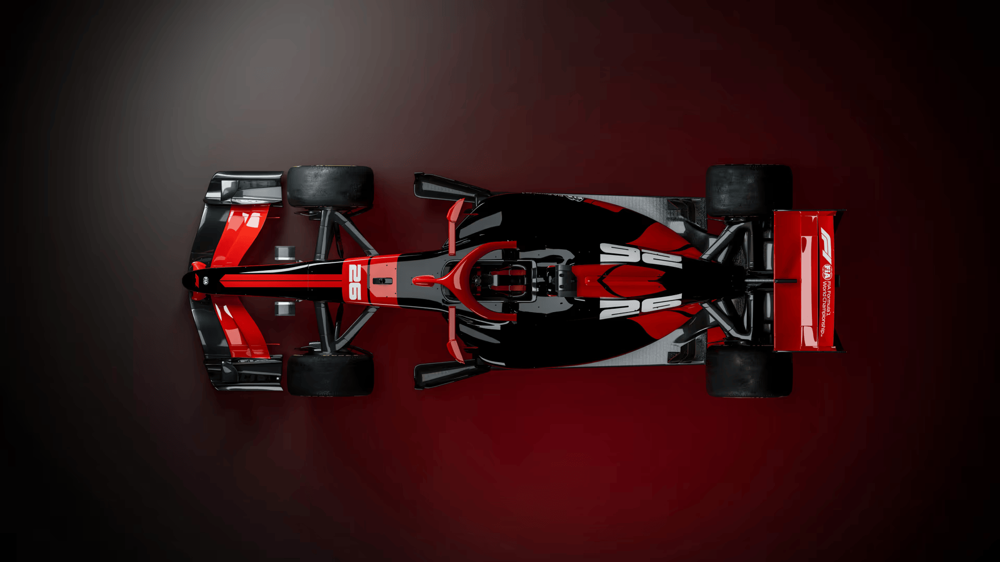

# FormulaHub Frontend

<p align="center">
	
</p>

<p align="center">
	<a href="#"></a>
	<a href="#"></a>
	<a href="#"></a>
	<a href="#"></a>
</p>

<p align="center">
	Modern Formula 1 analytics and strategy UI built with Next.js.
	<br />
	Includes schedule intelligence, standings, telemetry views, strategy simulation, and prediction workflows.
</p>

---

## Product Snapshot

<p align="center">
	
</p>

## Core Sections

- Dashboard: modular cards, drag-and-drop panel layout, quick race insights.
- Track and telemetry: session-level data exploration with visuals and racing context.
- Strategy simulator: race strategy scenarios and comparative outcomes.
- Prediction engine UI: generate and compare race predictions.
- Standings and schedule: current championship and event timeline views.
- Auth and profile: login/register, OAuth flow support, personalized preferences.

## Route Map

Main route groups in `src/app`:

- `compare`
- `dashboard`
- `login`
- `predict`
- `profile`
- `register`
- `schedule`
- `standings`
- `strategy`
- `telemetry`
- `track`

## Tech Stack

- Framework: Next.js 16 (App Router)
- UI: React 19, Tailwind CSS v4
- Data/API: Axios
- Motion: Framer Motion
- Charts: Recharts and Chart.js
- Forms and validation: React Hook Form, Yup
- Drag and drop: dnd-kit
- Auth UI: Google OAuth client integration

## Project Structure

```text
formula-hub-frontend/
	public/
		images/
	src/
		app/                # Next.js route segments
		components/         # Feature UI components
		lib/                # API and shared logic
		providers/          # App-level providers
```

## Local Setup

### 1. Install dependencies

```bash
npm install
```

### 2. Configure environment variables

Create `.env.local` and set:

```env
NEXT_PUBLIC_API_URL=http://localhost:8000/api
NEXT_PUBLIC_GOOGLE_CLIENT_ID=your_google_client_id
```

For port-forwarded development, use your tunnel backend URL:

```env
NEXT_PUBLIC_API_URL=https://<your-tunnel-id>-8000.<region>.devtunnels.ms/api
```

### 3. Start development server

```bash
npm run dev
```

Open `http://localhost:3000`.

## Scripts

- `npm run dev`: start local development server
- `npm run build`: production build
- `npm run start`: start production server
- `npm run lint`: run ESLint

## Backend Integration Notes

- Frontend consumes backend API via `NEXT_PUBLIC_API_URL`.
- If using browser + tunnel URL, backend CORS must include frontend origin.
- Prefer explicit backend caching and persistence over storing large generated JSON in browser memory.

## Deployment

### Vercel (recommended)

1. Import `formula-hub-frontend` to Vercel.
2. Set environment variables in project settings.
3. Deploy and validate route/API connectivity.

### Environment checklist

- `NEXT_PUBLIC_API_URL`
- `NEXT_PUBLIC_GOOGLE_CLIENT_ID`

## Troubleshooting

### CORS errors

- Confirm backend allows the exact frontend origin.
- Ensure no trailing slash mismatch in backend CORS origin list.
- Restart backend after changing CORS-related env values.

### API requests fail in tunnel mode

- Verify tunnel URL is active and reachable.
- Ensure frontend `.env.local` points to backend `/api` base.
- Restart frontend after `.env.local` changes.

### Build issues

- Remove stale lockfiles only if intentionally changing package manager.
- Run `npm install` then `npm run build`.

## Team Workflow

- Keep commits feature-scoped (UI, API integration, infra/docs).
- Commit generated artifacts only when intentionally versioned.
- Keep secrets only in `.env.local` and deployment environment settings.

---

<p align="center">
	
</p>
